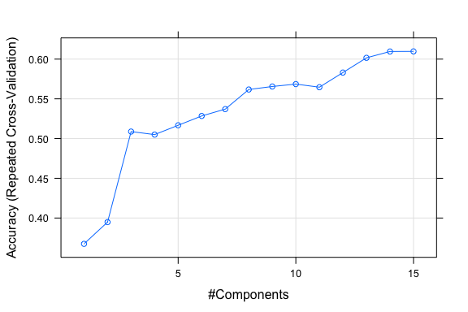
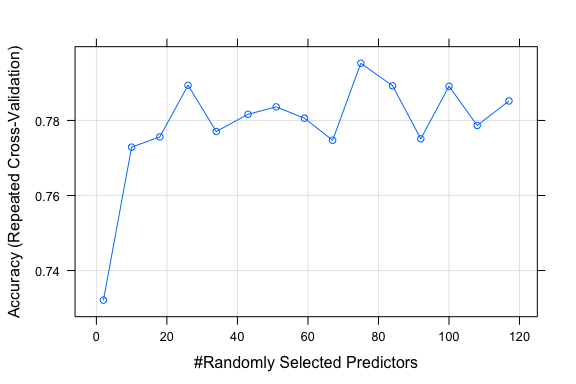
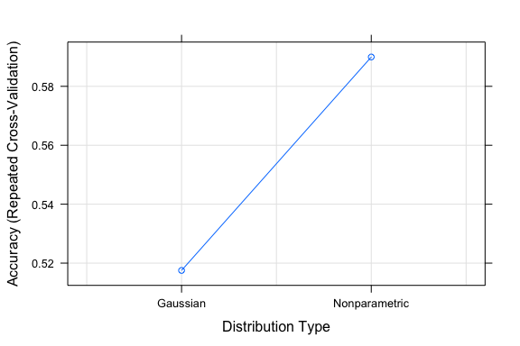
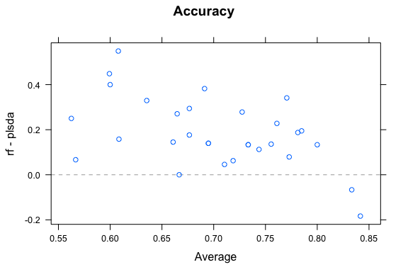

# Prediction_Assignment_Writeup
Milen Angelov  
August 13, 2015  
## Introduction
A group of enthusiasts who take measurements about themselves regularly with devices like Jawbone Up, Nike FuelBand, and Fitbit were asked to perform barbell lifts correctly and incorrectly in 5 different ways. The goal of this project is to predict the manner in which they perform barbell lifts - correctly and incorrectly in 5 different ways.

## Loading and preprocessing the data

```r
## Define global option for knitr
knitr::opts_chunk$set(fig.width=6, fig.height=4, fig.path='figure/', 
                      echo=TRUE, warning=FALSE, message=FALSE);

## Load libraries
library(caret);
```

```
## Loading required package: lattice
## Loading required package: ggplot2
```

```r
library(randomForest);
```

```
## randomForest 4.6-10
## Type rfNews() to see new features/changes/bug fixes.
```

```r
library(rpart);
library(pls);
```

```
## 
## Attaching package: 'pls'
## 
## The following object is masked from 'package:caret':
## 
##     R2
## 
## The following object is masked from 'package:stats':
## 
##     loadings
```

```r
library(MethComp);
```

```
## Loading required package: nlme
```

```r
library(knitr);

## Assure reproducability
set.seed(4321);
```

First let's get data we're going to use and load it into the memory

```r
## download data in case it has not done yet, on a first run
fTrainUrl <- "https://d396qusza40orc.cloudfront.net/predmachlearn/pml-training.csv";
fTestUrl <- "https://d396qusza40orc.cloudfront.net/predmachlearn/pml-testing.csv";

fTrainDest <- "./data/pml-training.csv";
if (!file.exists(fTrainDest)){
    download.file(fTrainUrl, destfile=fTrainDest, method="curl");
}

fTestDest <- "./data/pml-testing.csv"
if (!file.exists(fTestDest)){
    download.file(fTestUrl, destfile=fTestDest, method="curl");
}

## load data
trainData <- read.csv(fTrainDest, na.strings = c("NA", "", "#DIV/0!"));
testData <- read.csv(fTestDest, na.strings = c("NA", "", "#DIV/0!"));

## Do coherent check
all.equal(colnames(testData)[1:length(colnames(testData)) - 1], 
          colnames(trainData)[1:length(colnames(trainData)) - 1]);
```

```
## [1] TRUE
```

## Data Cleaning and PreProcessing

```r
## Remove non-zero variance
columns <- nearZeroVar(trainData, saveMetrics = TRUE);
trainData <- trainData[, !columns$nzv];

## Remove features not related to prediction like id, timestamp and names
trainData <- trainData[, -(1:6)];

## Convert classe into factor
trainData$classe <- factor(trainData$classe);
levels(trainData$classe);
```

```
## [1] "A" "B" "C" "D" "E"
```

First, we split the data into two groups: a training set and a test set. To do this, the ***createDataPartition*** function is used:

```r
inTrain <- createDataPartition(y = trainData$classe,  ## the outcome data are needed
                               p = 0.75,  ## The percentage of data in the training set
                               list = FALSE);  ## The format of the results

str(inTrain);
```

```
##  int [1:14718, 1] 1 2 3 4 5 6 7 8 9 10 ...
##  - attr(*, "dimnames")=List of 2
##   ..$ : NULL
##   ..$ : chr "Resample1"
```

```r
## By default, createDataPartition does a stratified random split of the data.
training <- trainData[inTrain, ];
testing <- trainData[-inTrain, ];

dim(training);
```

```
## [1] 14718   118
```

```r
dim(testing);
```

```
## [1] 4904  118
```

## Tune the model using different Algorithms
Three models will be estimated: Random forest, Least squares discriminant analysis (PLSDA) and Naive Bayes. To modify the resampling method, a trainControl function is used. We will use method "repeatedcv", which is used to specify repeated K-fold cross-validation. For pre-processing we will use centering and scaling.

```r
tc <- trainControl(method = "repeatedcv", 
                   repeats = 3,
                   classProbs = TRUE);

plsdaFit <- train(classe ~ ., data = training, method = "pls", tuneLength = 15, trControl = tc,
                  preProc = c("center", "scale"));

rfFit <- train(classe ~ ., data = training, method = "rf", tuneLength = 15, trControl = tc,
                  preProc = c("center", "scale"));

nbFit <- train(classe ~ ., data = training, method = "nb", tuneLength = 15, trControl = tc,
                  preProc = c("center", "scale"));
```

Let's visualize the results

```r
par(mfrow=c(1,3))
plot(plsdaFit);
```

 

```r
plot(rfFit);
```

 

```r
plot(nbFit);
```

 

We can see that the first two models provide very similar curve, even without using ROC for optimization. Let's now compare the Accuracy programatically:

```r
Methods <- c("Random forest", "PLSDA", "Naive Bayes");
Accuracy <- c(max(rfFit$results$Accuracy), 
              max(plsdaFit$results$Accuracy),
              max(nbFit$results$Accuracy));
perf <- cbind(Methods, Accuracy);
kable(perf);
```


Methods         Accuracy          
--------------  ------------------
Random forest   0.795236928104575 
PLSDA           0.609714052287582 
Naive Bayes     0.589950980392157 


## Predict new samples
To predict new samples, predict.train is used. For classification models, the default behavior is to calculated the predicted class. The option type = "prob" is used to compute class probabilities from the model.

```r
rfPred <- predict(rfFit, newdata = testing,  type = "prob");
plsdaPred <- predict(plsdaFit, newdata = testing,  type = "prob");
nbPred <- predict(nbFit, newdata = testing,  type = "prob");
```

Next we use resamples function to collect, summarize and contrast the resampling results. We also use [Bland???Altman](https://en.wikipedia.org/wiki/Bland%E2%80%93Altman_plot) type plot to visualize these results.

```r
resamps <- resamples(list(rf = rfFit, plsda = plsdaFit, nb = nbFit));
summary(resamps);
```

```
## 
## Call:
## summary.resamples(object = resamps)
## 
## Models: rf, plsda, nb 
## Number of resamples: 30 
## 
## Accuracy 
##         Min. 1st Qu. Median   Mean 3rd Qu.   Max. NA's
## rf    0.6000  0.7537 0.8000 0.7952  0.8559 0.9412    0
## plsda 0.3333  0.5294 0.6250 0.6097  0.6875 0.9333    0
## nb    0.3750  0.5000 0.5754 0.5900  0.6875 0.8000    0
## 
## Kappa 
##         Min. 1st Qu. Median   Mean 3rd Qu.   Max. NA's
## rf    0.4915  0.6844 0.7458 0.7389  0.8153 0.9248    0
## plsda 0.1477  0.4093 0.5271 0.5048  0.6020 0.9153    0
## nb    0.2000  0.3592 0.4569 0.4746  0.5965 0.7429    0
```

```r
xyplot(resamps, what = "BlandAltman");
```

 


## Saving results

```r
pml_write_files = function(x){
    n = length(x);
    for(i in 1:n){
        filename = paste0("problem_id_",i,".txt");
        write.table(x[i],
                    file = filename,
                    quote = FALSE,
                    row.names = FALSE,
                    col.names = FALSE);
  }
}

pml_write_files(rfPred);
pml_write_files(nbPred);
pml_write_files(plsdaPred);
```


## References
1. [How To Estimate Model Accuracy in R Using The Caret Package](http://machinelearningmastery.com/how-to-estimate-model-accuracy-in-r-using-the-caret-package/)
2. [A Short Introduction to the caret Package](https://cran.r-project.org/web/packages/caret/vignettes/caret.pdf)
3. [Predictive Modeling with R and the caret Package](https://www.r-project.org/nosvn/conferences/useR-2013/Tutorials/kuhn/user_caret_2up.pdf)
